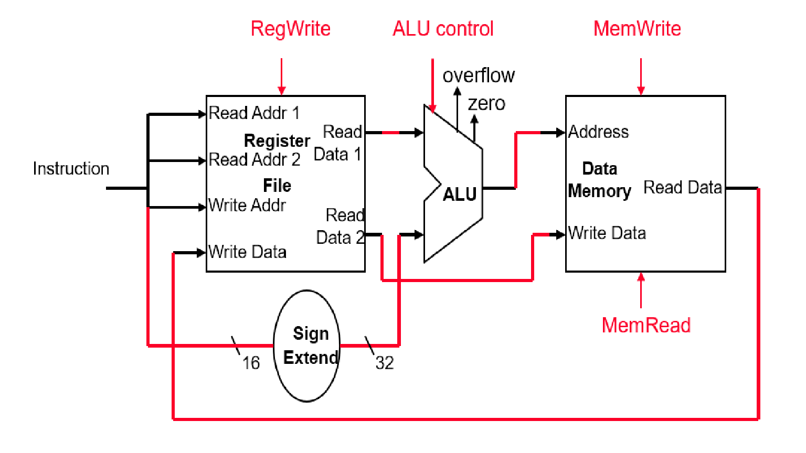

# MIPSIM
MIPS流水线处理器仿真器

## 经典的5段RISC流水线

经典的5段RISC流水线如图

在该结构中一条指令的执行过程分为以下5个时钟周期：

①	取指令周期（IF）：以程序计数器PC中的内容作为地址，从存储器中取出指令并放入指令寄存器IR；同时PC值加4（假设每条指令占4个字节），指向顺序的下一条指令。

②	指令译码/读寄存器周期（ID）：对指令进行译码，并用IR中的寄存器地址去访问通用寄存器组，读出所需的操作数。

③	执行/有效地址计算周期（EX）：在这个周期，ALU对在上一个周期准备好的操作数进行运算或处理。不同指令所进行的操作不同。

④	存储器访问/分支完成周期（MEM）：load指令用上一个周期计算出的有效地址从存储器中读出相应的数据；store指令把指定的数据写入这个有效地址所指出的存储器单元；分支指令若分支成功就把钱一个周期中计算好的转移目标地址送入PC，否则不进行任何操作；其他类型的指令在该周期不做任何操作。

⑤	写回周期（WB）：把结果写入通用寄存器组。

## 任务

该项目将创建一个流水线处理器的模拟器。模拟器能够加载指定的MIPS二进制（文本）文件(由你指定)，并生成MIPS的逐周期仿真。它也应该能产生/打印每个周期的寄存器，缓冲区和存储器数据的内容。Python编程语言实现流水线模拟器。

## 环境

* python>=3.7

## 需求分析

1. 在命令行下显示所有相关寄存器数据

2. 输入：mips汇编语句，

   输出：相关寄存器数据改变，并在命令行上显示

### mips汇编语句说明

1. MIPS指令集分类
   - 存储器读写指令：lw，sw
   - 算术逻辑运算指令：add，sub，and，or，slt
   - 程序控制指令：beq，j

2. 测试范例语句及其机器码

|                          | MIPS         | 机器码      |                                         |
| ------------------------ | ------------ | ----------- | --------------------------------------- |
| 取字 lw $Rt, offset($Rs) | lw $4, 4($2) | 0x8c44 0004 | 100011 00010 00100  0000 0000 0000 0100‬ |
| 存储 sw $Rt, offset($Rs) | sw $2, 8($2) | 0xac42 0008 | 101011 00010 00010  0000 0000 0000 1000‬ |

3. 寄存器变化

   lw $4, 4($2)
   
   

| CLK         | 0           | 1           |
| ----------- | ----------- | ----------- |
| PC          | 0x0000 0000 | 0x0000 0004 |
| $2          | 0x0000 0000 | 0x0000 0000 |
| $4          | 0x0000 0000 | 0x0000 0004 |
| $6          | 0x0000 0000 | 0x0000 0000 |
| 0x0000 0000 | 0           | 0           |
| 0x0000 0004 | 4           | 4           |
| 0x0000 0008 | 8           | 8           |

   sw $2, 8($2)

| CLK         | 0           | 1           |
| ----------- | ----------- | ----------- |
| PC          | 0x0000 0000 | 0x0000 0004 |
| $2          | 0x0000 0000 | 0x0000 0000 |
| $4          | 0x0000 0000 | 0x0000 0000 |
| $6          | 0x0000 0000 | 0x0000 0000 |
| 0x0000 0000 | 0           | 0           |
| 0x0000 0004 | 4           | 4           |
| 0x0000 0008 | 8           | 0           |

4. lw，sw流程图

   

   

